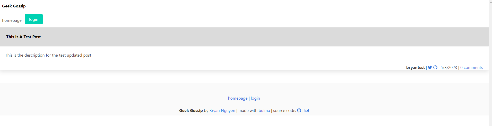

# Geek Gossip

## Description

This is Geek Gossip, a blog post application that allows users to post and share different thoughts and ideas that they might have. This application allows users to create an account and log in, see their own personal dashboard with their past posts, create posts, edit posts, as well as comment on other users posts. It also shows posts with other people's usernames and the date it was created.

[My Live Site](https://sleepy-springs-08377.herokuapp.com/)

## Mock-Up

### The following is an example of what the user might see once logged in:



## Table of Contents

- [Installation](#installation)
- [Code Example](#code-example)
- [Usage](#usage)
- [Learning Points](#learning-points)
- [Author Info](#author-info)
- [Credits](#credits)
- [License](#license)

## Installation

### For running my live-site:

1. \* [My Live Site](https://sleepy-springs-08377.herokuapp.com/)

### For running it on a local server:

1. Clone down the repository or download all files within repository
2. You will need to install node.js
3. You will need to edit the .env file to the database, user, and password that you use for SQL.
4. Run the SQL shell within VS code to instantiate your schema.sql by typing in terminal:

```
mysql -u root -p
```

5. Instantiate the seeds by typing in terminal:

```
npm run seed
```

6. Open terminal within VS Code and type 'node server.js'
7. Load up the local host url port using the port you set ( I set it at 3001 or use an app like insomnia to test different api routes for getting, creating, and updating data)
8. You might need to install these packages: sequelize, mysql2, express, dotenv.

```
npm i sequelize

npm i mysql2

npm i express

npm i dotenv
```

## Code Example

Here is an example of my get route for getting all posts and rendering it to the homepage:

```javascript
router.get("/", (req, res) => {
  console.log(req.session);

  Post.findAll({
    attributes: ["id", "title", "created_at", "post_content"],
    include: [
      {
        model: Comment,
        attributes: ["id", "comment_text", "post_id", "user_id", "created_at"],
        include: {
          model: User,
          attributes: ["username", "twitter", "github"],
        },
      },
      {
        model: User,
        attributes: ["username", "twitter", "github"],
      },
    ],
  })
    .then((dbPostData) => {
      const posts = dbPostData.map((post) => post.get({ plain: true }));
      res.render("homepage", {
        posts,
        loggedIn: req.session.loggedIn,
      });
    })
    .catch((err) => {
      console.log(err);
      res.status(500).json(err);
    });
});
```

## Usage

### Here you can see the homepage of the application with different options to see including past posts if there are any:


### Here you can see the login page:


### Here you can see the signup page:


### Here you can see a user creating and editing a post:


### Here is an example of the dashboard after creating a post you can see your past notes:


### Here you can see you are able to comment on posts as well:


## Learning Points

This project taught me a lot and solidified my knowledge of node.js as well as using different express packages like dotenv, mysql, and sequelize that created this application and allowed it to flourish. It provided me with different use cases of mySQL within javascript functionalities and applications. I really have solidified my knowledge in creating a full-stack application through this project. This taught me the entire flow of a full-stack application from the server.js to the connection.js, to the models, to the routes, and to the handlebars. It really allowed me to see how all the puzzle pieces fit together and create an application that has multiple different views and can store things not only in local storage but in sessions and in databases.

## About Me

Hi, my name is Bryan Nguyen I am an up and coming full-stack web developer working
on getting into the space with projects that support both my growth, belief, and imagination. I hope to one day work within the realm of AI, web-development, and even site-reliability/cyber-security.

## My links

### \* [Portfolio](https://bryannguyen9.github.io/Bryan-Nguyen-Portfolio/)

### \* [LinkedIn](https://linkedin.com/in/bryannguyen9)

### \* [Github](https://github.com/bryannguyen9)

## Credits

### Special thanks to David Chung:

- [David Chung's Github](https://github.com/dchung13/)
- [David Chung's LinkedIn](https://www.linkedin.com/in/david-chung-77141526b/)
- [David Chung's Portfolio](https://dchung13.github.io/David-Chung-Portfolio/)

### Special thanks to these reference websites that taught me different functionalities within my website for me to create a seamless experience for users.

1. [Stack Overflow](https://stackoverflow.com/questions/64220107/passing-sql-queries-into-inquirer-prompt)
2. [NpmJS for mysql2](https://www.npmjs.com/package/mysql2)
3. [NpmJS for inquirer](https://www.npmjs.com/package/inquirer)

## License

[](https://opensource.org/licenses/MIT)

This project is licensed under the MIT License.

MIT License

    Copyright (c) [2023] [Bryan Nguyen]

    Permission is hereby granted, free of charge, to any person obtaining a copy
    of this software and associated documentation files (the "Software"), to deal
    in the Software without restriction, including without limitation the rights
    to use, copy, modify, merge, publish, distribute, sublicense, and/or sell
    copies of the Software, and to permit persons to whom the Software is
    furnished to do so, subject to the following conditions:

    The above copyright notice and this permission notice shall be included in all
    copies or substantial portions of the Software.

    THE SOFTWARE IS PROVIDED "AS IS", WITHOUT WARRANTY OF ANY KIND, EXPRESS OR
    IMPLIED, INCLUDING BUT NOT LIMITED TO THE WARRANTIES OF MERCHANTABILITY,
    FITNESS FOR A PARTICULAR PURPOSE AND NONINFRINGEMENT. IN NO EVENT SHALL THE
    AUTHORS OR COPYRIGHT HOLDERS BE LIABLE FOR ANY CLAIM, DAMAGES OR OTHER
    LIABILITY, WHETHER IN AN ACTION OF CONTRACT, TORT OR OTHERWISE, ARISING FROM,
    OUT OF OR IN CONNECTION WITH THE SOFTWARE OR THE USE OR OTHER DEALINGS IN THE
    SOFTWARE.

For further details on the MIT License you can click on this link: [Link to MIT License Details](https://opensource.org/license/mit/)
